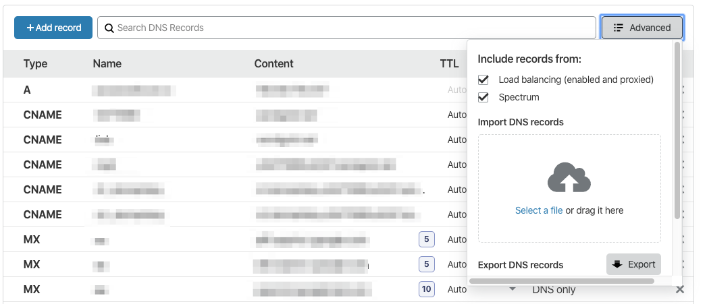

# All the Gsuite SEttings into Cloudflare quickly
Very quick way to add G-suite DNS settings to your domain on Cloudflare. MX records, Text Verification, SPF, and DKIM

Over here we use Clludflare a lot and Gsuite a lot, we have added enough domains to G-Suite to know it can eb slightly time-consuming to add the DNS settings manually. So we create this little file to import them faster.

1. Download the [attached txt file](gsuite-cloudflare.txt), modify it with your unique SPD and DKIM records.
2. Login to the Cloudflare domain you want to add records to, click on DNS settings.
3. Click the Advanced Icon and drag the text file in.

That's all ;)

